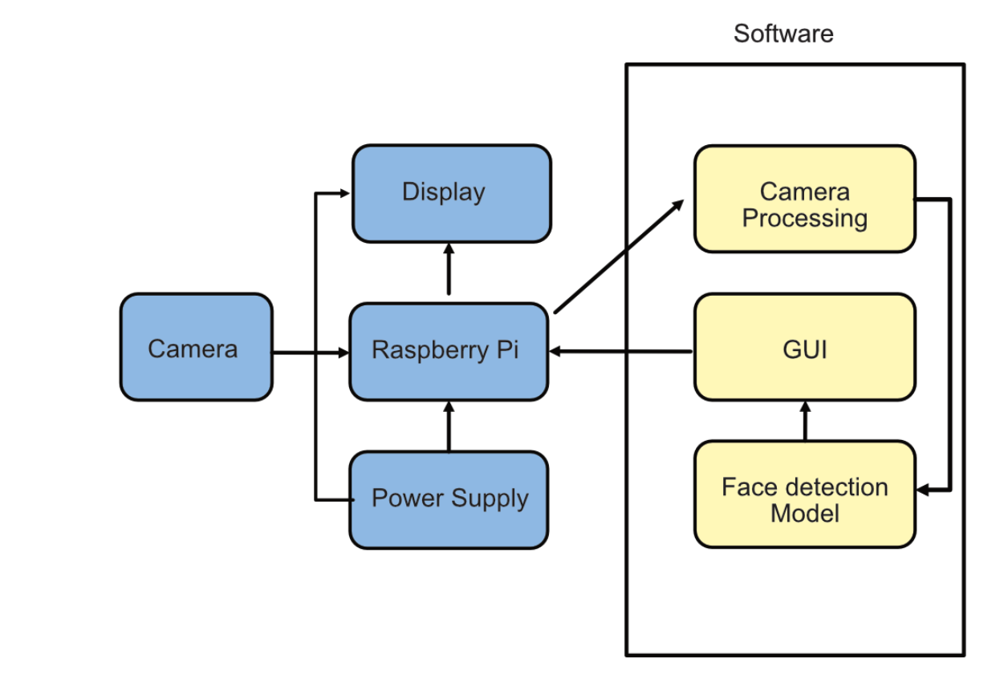

# ECE 525 Smart Doorbell

**Team Members**: Aidan Shepston, Jack Guo, Marilyn De Leon Matul

## Team Members Responsibilities: 
Aidan Shepston
- ML Model management
Jack Guo
- Hardware setup lead
- Research
Marilyn De Leon Matul
- Software lead implement ML pipeline 
- Documentation 

## Project Timeline:
September 28, 2025
- Preliminary Project Proposal submitted
October, 2025
- Initial setup of raspberry pi and camera.
- Training and development of a machine learning model on google collab.
November, 2025
- Testing of a machine learning model on raspberry pi.
December, 2025
- Making extra features of the project
- Alert system
- Object detection

## Motivation

Smart doorbells can sometimes depend heavily on cloud infrastructure, which can introduce latency, privacy concerns, and higher costs. By deploying ML systems on a Raspberry Pi in real-world settings we can achieve real-time detection, address privacy concerns and, and lower costs. 

## Design Goals

- Use a Raspberry Pi with a camera module to design a smart doorbell 
- The smart doorbell will be able to detect people
- The smart doorbell will be able to classify whether a person is known or unknown
- We will optimize the ML model to be lightweight and efficient using TensorFlow Lite
- Time permitting, the smart doorbell will detect a delivery worker
- Time permitting, the smart doorbell will provide an optional alert mechanism

## Deliverables
Training and optimization of a face detection model that is able to detect different people
Deployment of the face detection model on a Raspberry Pi
Optionally: making an alert system that alerts the person when people or other objects are detected

## System Blocks

## Background: 
Edge devices like Raspberry Pi are increasingly used for deploying ML systems in real-world settings. A common home application is a smart doorbell that can identify visitors and
provide useful alerts without relying on heavy cloud infrastructure.
• Goal: Use Raspberry Pi with a camera module to design a smart doorbell that can detect people
and classify whether they are recognized (e.g., known household members) or unknown.

## HW/SW Requirements: 

Raspberry Pi - Low power system that the ML model will be deployed on. Will require lots of optimization to make the model run on such low powered hardware.

Camera - Need a camera with enough definition to make sure faces are visually distinguishable 
while also being able to interface with the Raspberry Pi

ML Model - Will need a trained and quantized model that can be shrunk enough to run on low powered hardware. This can be created with TensorFlow Lite and trained based on existing datasets of faces on the internet. The type of model will depend on what it found in research, but something like a Convolutional Neural Network may work well.

Interfacing software - Will need software in order to take images from the camera and run them through the model on the Raspberry Pi. If we choose to create the alert mechanism, we would also need to figure out how to send a notification over the network to a phone, which would require some more networking and UI components in the software. 

## References:

https://arxiv.org/abs/1704.04861 - This paper describes a method to build light-weight neural networks that are good for mobile and embedded vision applications. We could use some of the methodology described in this paper to create our own light-weight facial recognition ML model. The paper also explains how user tunable hyper-parameters can be modified to fix a specific power requirement, something which would also be useful for this project.

https://github.com/Linzaer/Ultra-Light-Fast-Generic-Face-Detector-1MB - This is an open source light weight face detection algorithm which we could look at for inspiration in our own design. This model was written in python and C++ and could be a good starting point to get some ideas on how to create our own model. 

https://arxiv.org/html/2311.15326 - This paper compares and contrasts a number of light weight facial recognition models which could once again start us in the right direction for our own development of a model. 

